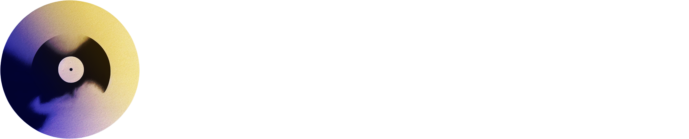

# MUSTARD - Music Universal Synthesis and Translation with Rich Detail

<br>

<br>

<kbd>
<font color="red">Attention :</font> Ce projet est actuellement en cours de développement et n'est même pas encore en version alpha.
</kbd>

<br>
<br>

MUSTARD est un logiciel en libre accès puissant conçu pour la traduction avancée de la musique, allant de la séparation des pistes instrumentales et vocales à la synthèse vocale de haute qualité en passant par la traduction des paroles. Notre objectif est de fournir une solution complète pour les amateurs de musique et les créateurs de contenu.

## Fonctionnalités clés

- **Séparation des pistes** : Divisez facilement une piste musicale en pistes instrumentales et vocales distinctes.
- **Reconnaissance vocale** : Transcrivez automatiquement les paroles chantées.
- **Traduction multilingue** : Traduisez les paroles dans la langue de votre choix tout en préservant la musicalité.
- **Synthèse vocale de haute qualité** : Créez des versions vocales traduites réalistes en utilisant des modèles de voix avancés.
- **Fusion des pistes** : Combinez la piste instrumentale originale avec la piste vocale traduite.
- **Personnalisation** : Personnalisez les métadonnées de la chanson, telles que le titre, l'artiste, etc.
- **Export** : Exportez facilement le fichier audio traduit final au format de votre choix.

## Installation

```bash
# Exemple d'installation pour Linux
git clone https://github.com/adrbn/mustard.git
cd mustard
./install.sh
```

## Usage

```bash
# Example usage
mustard --input input.mp3 --output output.mp3 --language french
```

## Documentation

Pour des informations détaillées sur l'utilisation, la configuration et la personnalisation de MUSTARD, consultez notre [documentation complète](link-to-docs).

```
Rien ici pour l'instant
```

## Contribuer

Nous accueillons les contributions de la communauté ! Consultez notre guide de contribution pour en savoir plus sur la manière de contribuer au projet.
```
Rien ici pour l'instant
```

## Licence

Ce projet est sous licence MIT. Consultez le fichier [LICENSE](LICENSE) pour plus de détails.


## Contact

Pour toute question ou commentaire, veuillez nous contacter à [contact@mustardai.com].
